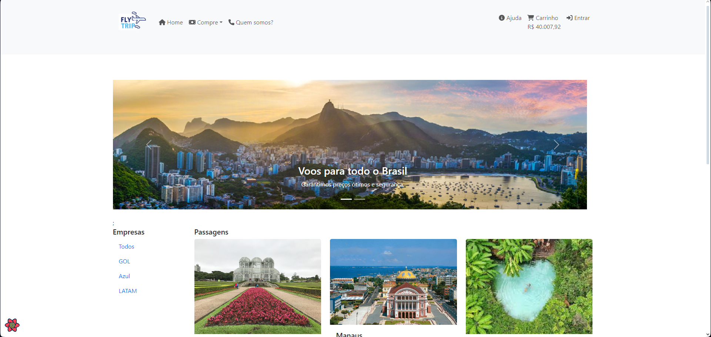
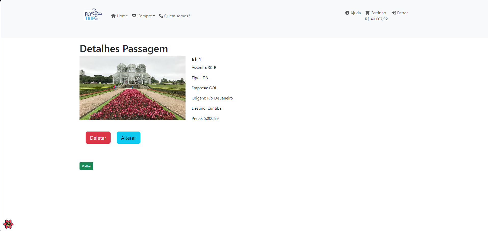
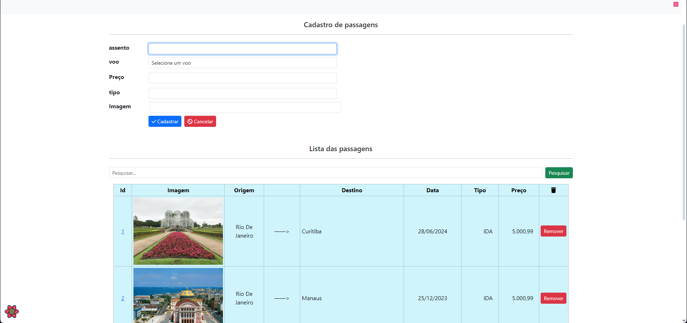
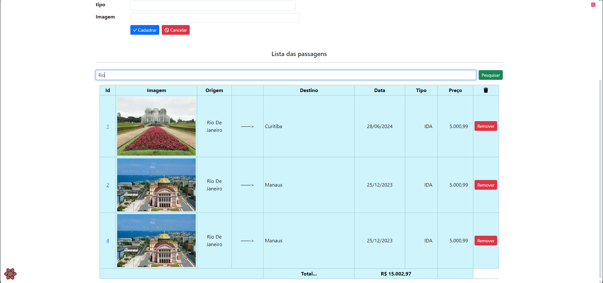
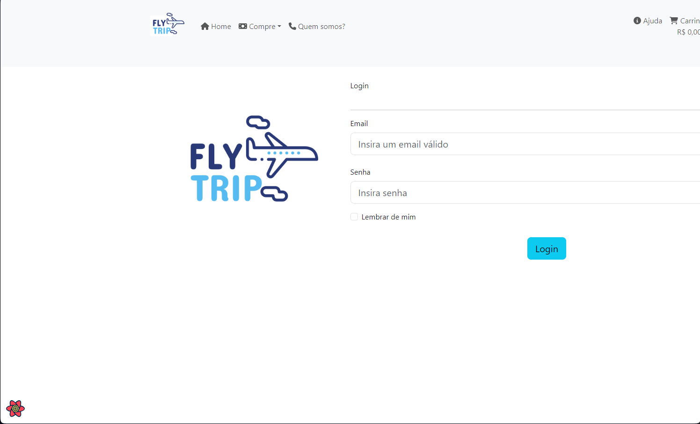
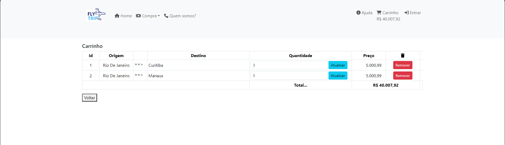

# Dev Web
  - Autor: Pedro Ximenes
  - Projeto praticado na disciplina desenvolvimento Web, usando React para o Front-End e Java para o Back-End.
  - Organização: java_backend está o código desenvolvido em java com SpringBoot para realizar o backend do projeto. React_frontend está o código desenvolvido com o React para realizar o frontend. Na pasta Paginas_Estatica_HTML são apenas páginas iniciais feitas para treinar html com bootstrap.
  - Site de passagens aéreas com entidades de Passagem e Voo. Um voo possui várias passagens e uma passagem está conectada com um voo, obrigatoriamente.
  - Segue algumas imagens do projeto:

     Tela Inicial:
    

     Detalhes Passagem: 
    

     Detalhes Passagem: 
    

     Listagem com cadastro/alteração: 
    

     Listagem com busca: 
    

     Tela Login: 
    

     Carrinho integrado com back: 
    

